# MEDviz — Target Architecture

> **What this document is.** A production target ("10/10") architecture for the MEDviz
> telemedicine platform. It is deliberately opinionated: where there is a choice, it
> picks one and explains the tradeoff. Every major component section answers the same
> four questions — **why it exists, the alternatives, the tradeoffs, and the scaling
> limits.**
>
> **How to read CURRENT vs TARGET.** Each section is split into a `CURRENT` state
> (what the code actually does today, grounded in the repo) and a `TARGET` state
> (where it should go). Do not confuse the two: most of the security baseline is
> already real; most of the eventing, video, and observability is not.
>
> **Stack today (grounded):** Express 4 + Mongoose 7 (`backend/`), Create React App
> via CRACO + React 19 + react-router 7 (`frontend/`), a local Ollama LLM
> (`llama3.2:3b`) behind a deterministic triage engine, MongoDB, Nodemailer (Gmail)
> for OTP, and `setInterval`-based cron jobs.

---

## Table of contents

1. [System overview](#1-system-overview)
2. [Frontend architecture](#2-frontend-architecture)
3. [Backend architecture](#3-backend-architecture)
4. [Data architecture](#4-data-architecture)
5. [Event architecture](#5-event-architecture)
6. [AI architecture](#6-ai-architecture)
7. [Notification architecture](#7-notification-architecture)
8. [Video consultation architecture](#8-video-consultation-architecture)
9. [Observability architecture](#9-observability-architecture)
10. [Security architecture](#10-security-architecture)
11. [Appendix: ADRs and migration sequencing](#appendix-adrs-and-migration-sequencing)

---

## 1. System overview

### Why this shape

MEDviz is a three-sided application — **patients**, **doctors**, **admins** — sitting
on top of PHI (protected health information). That single fact drives almost every
architectural decision: every component must be auditable, every data path must be
access-controlled, and no automated component may make a medical decision. The system
is a classic API-backed SPA today, and the target keeps that shape (it is the right
shape for a small clinical product) while pulling the side-effecting concerns —
scheduling, notifications, video, AI, observability — out of the request path and
behind explicit boundaries.

### CURRENT

- One Express process (`backend/server.js`) serving a REST API under `/api/*`.
- One React SPA (`frontend/`) talking to it through `frontend/src/api/axiosConfig.js`.
- One MongoDB via Mongoose (`maxPoolSize: 20`).
- LLM = local Ollama (`backend/services/ai.js` `createOllamaClient`), used **only** to
  phrase explanations; severity is decided deterministically.
- Notifications = MongoDB `Notification` documents polled by the frontend; email only
  for password-reset OTP (`backend/utils/otpService.js`).
- "Cron" = two `setInterval` loops started in `server.js`
  (`startAutoCompleteJob`, `startAppointmentAlertJob`).
- Files = authenticated passthrough from local disk (`backend/routes/files.js`,
  `uploads/`).
- No cache, no object store, no message queue, no metrics, no error tracker.

### TARGET

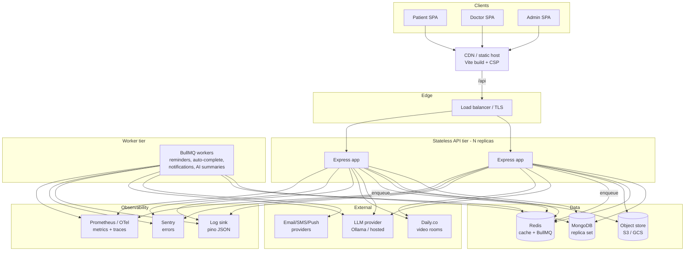

**Why each box exists**

| Component | Why | Alternative | Tradeoff | Scaling limit |
|---|---|---|---|---|
| Stateless API tier | Horizontal scale, zero-downtime deploys, graceful drain already wired in `server.js` | Single instance (today) | Must remove all in-process state (see [§5](#5-event-architecture)) | Bound by Mongo connections (`maxPoolSize × replicas`) |
| MongoDB replica set | Document model already fits (nested `medicines`, flexible notification shapes); replica set gives failover + read scaling | Postgres | Postgres gives stronger relational integrity for appointments/RBAC, but migration cost is high and the team knows Mongo | Write throughput on the primary; sharding needed only at very high volume — unlikely for a clinic product |
| Redis | Cache + the queue backend for BullMQ + shared rate-limit + session/conversation state | Memcached (cache only) | Redis does more (queues, pub/sub) so it earns its place; adds an ops dependency | Single-node memory; Redis Cluster if it ever matters |
| Object store (S3/GCS) | PHI documents must not live on an ephemeral pod disk; enables signed URLs | Keep local disk (today) | Local disk is simplest but loses durability and blocks multi-replica file reads | Effectively unlimited |
| LLM provider | Phrasing only, never decisions (see [§6](#6-ai-architecture)) | Hosted Claude/GPT | Local Ollama keeps PHI on-prem (big HIPAA win); hosted is better prose but needs a BAA | LLM latency/throughput; mitigated by it being off the critical path |
| Daily.co video | Managed WebRTC SFU, HIPAA BAA available (see [§8](#8-video-consultation-architecture)) | Twilio, Jitsi self-host | Build vs buy | Provider concurrency limits |
| Observability stack | You cannot operate PHI systems blind | Logs only | Full stack costs money/ops but is non-negotiable for clinical SLAs | N/A |

---

## 2. Frontend architecture

### CURRENT

- Create React App wrapped in **CRACO** (`frontend/craco.config.js`) purely to inject
  Node polyfills (`crypto-browserify`, `stream-http`, `buffer`, …). That polyfill list
  is a smell: a browser app should not need `crypto`/`http` shims — something is
  importing a Node library client-side.
- React 19, `react-router-dom` 7, routing entirely in `frontend/src/App.js` with
  `ProtectedRoute` gating `/patient`, `/doctor`, `/admin` by role.
- **No state-management library.** Auth state is `localStorage` (`token`, `user`) read
  directly inside `axiosConfig.js` and `ProtectedRoute`.
- API layer = a single axios instance (`frontend/src/api/axiosConfig.js`) with a request
  interceptor that attaches the bearer token and a response interceptor that force-logs-out
  on a 401 whose body says "expired". Feature wrappers like `chatApi.js` and
  `services/doctorService.js` sit on top.
- Design tokens exist but only as a JS object (`frontend/src/theme/colors.js`) plus
  per-component CSS and two global doctor theme files imported in `App.js`.

### TARGET

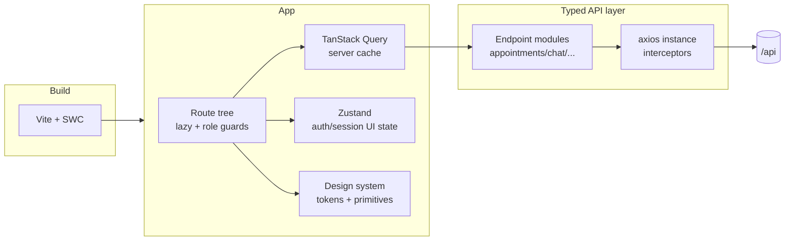

**CRA → Vite migration (recommended, opinionated).** Move off CRA/CRACO to **Vite**.
CRA is effectively unmaintained, build/HMR are slow, and the only reason CRACO exists
here is to bolt Node polyfills onto Webpack. Vite's path:

1. Find what pulls Node modules into the bundle (the polyfill list points at it — likely
   an import that should be server-side or replaced with a Web Crypto / browser API).
   Remove the dependency rather than polyfilling it.
2. `npm create vite@latest` (React + SWC), port `index.html` to the project root, move
   `REACT_APP_*` env vars to `import.meta.env.VITE_*` (one of them is
   `REACT_APP_API_BASE` in `axiosConfig.js`).
3. Delete `@craco/craco`, `react-scripts`, and the entire `devDependencies` polyfill block.
4. Keep `react-router` 7 and React 19 as-is — both are Vite-native.

- **Alternative:** Next.js. Rejected for now — MEDviz is a pure SPA behind an auth wall;
  SSR/RSC buy little, and the app/router migration is far larger than CRA→Vite.
- **Tradeoff:** Vite uses esbuild/Rollup, so a few CRA-era Jest/webpack assumptions need
  porting (use Vitest). Worth it for ~10× faster dev loop.
- **Scaling limit:** none meaningful for a SPA; build time grows with module count, which
  Vite handles far better than CRA.

**State management.** Introduce two libraries with a clean split:

- **TanStack Query** for *server state* — appointments, notifications, reports, doctor
  lists. Today every screen re-fetches manually; Query gives caching, background refetch,
  and dedupe for free, and is the right substrate for the notification-polling that
  [§7](#7-notification-architecture) describes.
- **Zustand** for the small amount of *client/UI state* — the decoded auth session,
  toasts, modal state. Replaces the scattered `localStorage.getItem('token')` reads.
- **Alternative:** Redux Toolkit. Rejected — overkill for this app's state volume.
  **Alternative:** React Context only. Rejected — re-render storms and no caching.

**API layer.** Keep the single axios instance (it is already correct: interceptor-based
auth + 401 handling) but harden it:

- Move the token out of `localStorage` toward an in-memory store + httpOnly refresh cookie
  (XSS exfiltration of a bearer token in `localStorage` is the current weak point).
- Generate or hand-write **typed endpoint modules** per resource (continue the
  `chatApi.js` pattern) so components never touch raw `API.post` strings.
- Adopt the `X-Request-Id` the backend already returns (`security.js` sets it) and log it
  client-side for support correlation.

**Design system.** Promote `theme/colors.js` into proper **design tokens** (CSS custom
properties generated from the token source), then build a thin primitive layer (Button,
Card, Field, Modal) consuming those tokens. This kills the per-component CSS drift and the
two competing doctor-theme stylesheets. Keep it in-repo; a separate package is premature.

---

## 3. Backend architecture

### Why layering

The codebase already has the *security* layering right at the router boundary
(`server.js`) but the *business* layering is missing: route handlers like
`routes/appointments.js` directly orchestrate Mongoose models, build notification
documents inline, and even re-implement the auto-complete job
(`autoCompleteOldAppointments` is duplicated in both `routes/appointments.js` and
`jobs/appointmentAutoComplete.js`). The target introduces a **service layer** so that
business rules live in one place and are reachable from both HTTP handlers and queue
workers.

### CURRENT request path

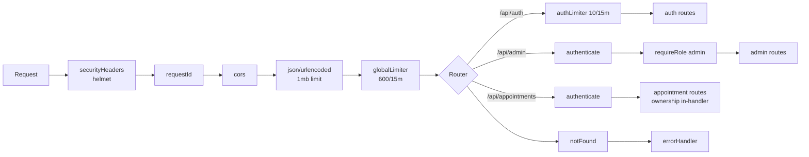

The middleware ordering in `server.js` is correct and deliberate: fail-fast config checks
before `listen`, `trust proxy` set for correct `req.ip`, security headers and request-id
first, rate-limit before routing, centralized 404 + error handler last, graceful
shutdown + process guards. This is the security baseline to preserve.

### TARGET layering

```
HTTP route  →  middleware (authn, RBAC, validate, audit, rate-limit)
            →  controller (parse req, shape res — thin)
            →  service (business rules, transactions, orchestration)
            →  model (Mongoose schema + indexes)
```

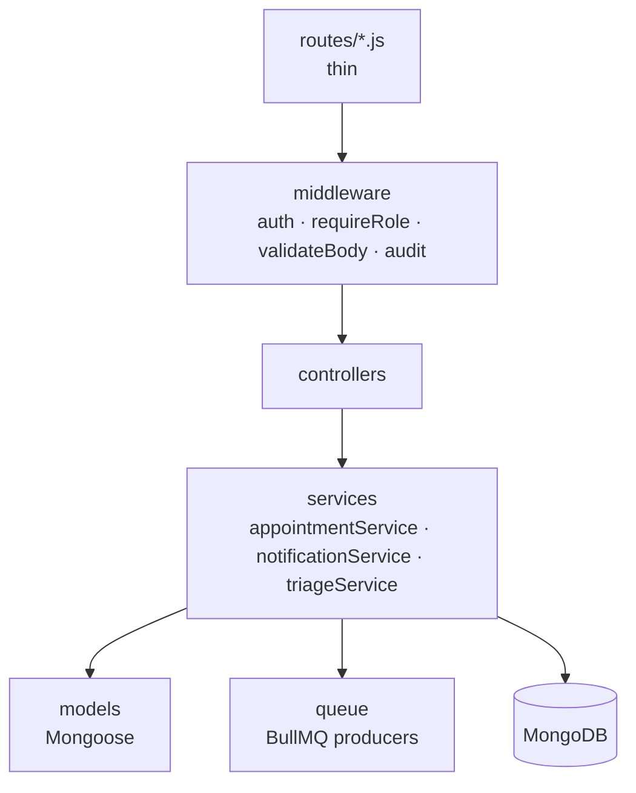

**RBAC — where it lives.** Authentication and coarse role gating already live at the
**router boundary** in `server.js` via `authenticate` + `requireRole(...)`
(`middleware/auth.js`). Keep that. The missing piece is **per-record ownership**, which
`middleware/auth.js` already provides a tool for — `requireOwnership(getOwnerId)` and
`loadAccount` — but which is *not yet wired into the mutating handlers*. For example
`routes/appointments.js` `POST /:id/approve`, `/reject`, `/reschedule`, `DELETE /:id`
currently `findById` and mutate **without checking the appointment belongs to the calling
doctor**. Target: every such handler either uses `requireOwnership` middleware or asserts
ownership in the service layer before mutation. This is called out in **ADR-002** and is
the single highest-value backend hardening task.

**Where validation lives.** `middleware/validate.js` (`validateBody`,
`validateObjectIdParam`) — zero-dependency, schema-driven, runs at the route boundary
before any DB call. Target: attach a `validateBody` schema to **every** mutating route
(today `routes/appointments.js` reads `req.body` fields raw). Validate only at the system
boundary; trust internal service calls.

- **Alternative to hand-rolled validate.js:** Zod or Joi. Tradeoff: richer, but adds a
  dependency and the in-house validator already covers the needed cases (required, type,
  email, ObjectId, enum, array). Revisit if schemas grow complex.

**Where audit lives.** `middleware/audit.js` `audit(action, resourceType)` attaches an
`res.on('finish')` hook writing an `AuditLog` row (fire-and-forget, never blocks the
request). Target: mount `audit(...)` on every PHI read/write route — appointment
approve/reject, prescription create, report view/download, file access (already on
`routes/files.js`). See [§10](#10-security-architecture).

**Error handling.** `middleware/errorHandler.js` is already the single response shaper:
`AppError` for expose-safe 4xx, `asyncHandler` to funnel rejections, Mongoose error
normalization, never leaks 5xx stack to clients, logs with `requestId`. Target: delete
the per-handler `try/catch → res.status(500)` blocks (pervasive in
`routes/appointments.js`) and wrap handlers in `asyncHandler` instead.

- **Scaling limit:** the API tier is stateless once in-process state ([§5](#5-event-architecture))
  is removed, so it scales linearly with replicas up to the Mongo connection ceiling.

---

## 4. Data architecture

### CURRENT collections

| Collection | Purpose | Notable shape |
|---|---|---|
| `Patient`, `Doctor`, `Admin` | Accounts, one per role | password/otp fields stripped on read in `loadAccount` |
| `Appointment` | Core entity | status enum `pending→scheduled→rescheduled/cancelled/completed`; `appointment_time` is a **string** ("9:00 AM") |
| `Prescription` | Rx with embedded `medicines[]` | references appointment + patient + doctor; denormalizes `patient_name/age/gender` |
| `Report` | Uploaded PHI docs | `filePath` on local disk |
| `Notification` | In-app messages | dual schema: new `receiver_*`/`sender_*` + legacy `doctor_id`/`patient_id` |
| `Task` | Doctor/patient to-dos tied to appointments | `assigned_to`, `related_appointment_id` |
| `ChatHistory` | Persisted triage sessions | one active per patient, `messages[]`, `severity` |
| `AuditLog` | Append-only access trail | `timestamps: { createdAt: 'at' }`, indexed for forensics |
| `DoctorSettings` | Per-doctor config | — |

### Indexing strategy (already partly real)

`models/Appointment.js` is the example to follow — it already declares the right indexes:

```js
appointmentSchema.index({ doctor_id: 1, status: 1, appointment_date: 1 });
appointmentSchema.index({ patient_id: 1, status: 1, appointment_date: 1 });
appointmentSchema.index({ status: 1, appointment_date: 1 }); // cron jobs
// double-booking guard at the DB layer:
appointmentSchema.index(
  { doctor_id: 1, appointment_date: 1, appointment_time: 1 },
  { unique: true, partialFilterExpression: { status: { $in: ['pending','scheduled','rescheduled'] } } }
);
```

The **partial unique index** is the important one: it closes the read-then-write
double-booking race that `routes/appointments.js` only guards with a non-atomic
`findOne` check. `Notification` and `AuditLog` are also indexed. **Target:** every model
gets indexes matching its real query shapes — `Report` by `patient_id + uploadedDate`,
`Task` by `doctor_id + status` and `related_appointment_id`, `ChatHistory` by
`patientId + status`, `Prescription` by `patient_id` and `appointment_id`.

**Index design rule:** an index should match a query's equality fields first, then sort/
range fields (the ESR rule). The existing `{doctor_id, status, appointment_date}` follows
this. Avoid over-indexing — each index is write amplification.

### Read vs write patterns

- **Writes** are bursty around appointment lifecycle transitions and fan out into
  multiple documents (an approve creates 1 patient notification + 2 tasks + updates
  notifications/tasks — see `routes/appointments.js` `POST /:id/approve`). Target: wrap
  these multi-document mutations in a **MongoDB transaction** (replica set required) so a
  partial failure can't leave a scheduled appointment with no patient notification.
- **Reads** dominate: dashboards and notification polling. These belong behind a
  **Redis read cache** with short TTLs and explicit invalidation on the corresponding
  write.

### Where aggregations replace N+1

The current code has clear N+1 and fan-out problems to fix with aggregation/`$lookup`:

- `jobs/appointmentAlerts.js` loops every scheduled appointment and issues a
  `Notification.findOne({...$regex...})` **per appointment per alert window** to dedupe —
  a regex-on-message dedupe inside a loop. Target: replace the "have I already sent this"
  check with a structured field (e.g. `alerts_sent: ['24h','1h','15m']` on the
  appointment, or a unique index on `{appointment_id, alert_kind}`) and a single bulk
  query, not per-row regex scans.
- Building doctor dashboards that need appointment + patient + task counts should use a
  single `$lookup`/`$facet` aggregation rather than `populate` + follow-up queries.
- `populate('patient_id', ...)` (used throughout `routes/appointments.js`) is fine for
  single documents but becomes N+1-ish across large lists; prefer an aggregation pipeline
  that projects exactly the fields the screen needs.

**Tradeoffs.** Aggregations are faster and atomic-read but harder to read and version.
Use them for hot list/dashboard paths; keep simple `findById().populate()` for detail
views. **Scaling limit:** Mongo aggregations run on the primary unless read preference is
set; route heavy analytics (`AdminAnalytics`) to a secondary or a nightly rollup
collection.

**Data hygiene target.** `appointment_time` as a free-text string ("9:00 AM") forces
every consumer to re-parse it (`parseAppointmentTime` is copy-pasted in three files).
Store appointments as a single timezone-aware `Date` (start) + duration. This removes the
parsing class of bugs entirely.

---

## 5. Event architecture

### CURRENT

Two background jobs are **`setInterval` loops inside the API process**, started after the
Mongo connect in `server.js`:

- `jobs/appointmentAutoComplete.js` — every hour, marks scheduled appointments 6h+ past
  due as `completed`.
- `jobs/appointmentAlerts.js` — every 30 min, sends 24h / 1h / 15min reminders.

Problems this creates:
1. **Runs once per replica.** The moment the API tier scales past one instance, every job
   runs N times → duplicate reminders, duplicate completions.
2. **In-process timers die with the process** and have no retry, no backoff, no
   dead-letter, no visibility.
3. **Dedupe by regex** (`message: { $regex: '24 hours' }`) is fragile and O(appointments)
   per tick.
4. The auto-complete logic is **duplicated** between the job and `routes/appointments.js`.

### TARGET — BullMQ on Redis

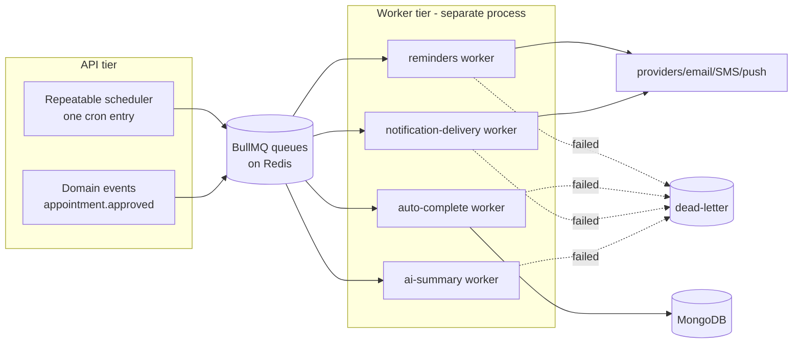

**Recommendation: BullMQ + Redis.** Reasons, concretely:

- The system **already needs Redis** for caching and shared rate-limiting, so BullMQ adds
  no new infra dependency — it reuses the same Redis. That is the deciding factor.
- BullMQ gives **repeatable (cron) jobs**, retries with exponential backoff, rate
  limiting, delayed jobs (perfect for "send 24h before" — schedule the reminder *at
  approval time* instead of polling every 30 min), and a dead-letter mechanism.
- Moving jobs to a **separate worker process** makes the API tier truly stateless and
  lets jobs run **exactly once** regardless of API replica count (BullMQ's lock ensures a
  job is processed by one worker).

**Alternatives considered:**

| Option | Verdict | Why |
|---|---|---|
| **Agenda** (Mongo-backed jobs) | Rejected | No second dependency (uses Mongo), but weaker concurrency/retry semantics and worse throughput than BullMQ; couples job state to the PHI database |
| **External cron** (k8s CronJob / system cron hitting an endpoint) | Rejected as primary | Simple and durable, but no per-job retry/backoff/visibility, and "fire an HTTP request on a schedule" still needs an idempotent handler; fine as a *fallback trigger* but not the model |
| **Keep `setInterval`** | Rejected | Breaks the instant you run two API replicas |
| **Cloud queue (SQS + Lambda)** | Deferred | Strong at scale but heavier ops and vendor lock for a clinic-scale product |

**Design notes for the migration.**

- Convert polling reminders to **delayed jobs scheduled at approval time**: when
  `appointment.approved` fires, enqueue three delayed jobs (24h/1h/15m before start).
  This deletes the every-30-min scan and the regex dedupe in one move — the job *is* the
  reminder.
- Auto-complete stays as a single **repeatable job** (the one place a periodic sweep is
  genuinely needed) and the duplicated route helper is deleted.
- All jobs must be **idempotent** (use a `jobId` keyed on appointment+kind) so a retry
  can't double-send.

**Scaling limit:** BullMQ throughput is bounded by Redis; a single Redis handles tens of
thousands of jobs/sec — orders of magnitude beyond a clinic's reminder volume. Scale
workers horizontally; they coordinate through Redis locks.

---

## 6. AI architecture

### The core pattern (already implemented — preserve it exactly)

MEDviz's AI design is **its best architectural decision** and must be protected as the
product grows. The pattern, implemented across `services/ai.js` and `bot.js`:

> **Deterministic engine decides; the LLM only phrases.**

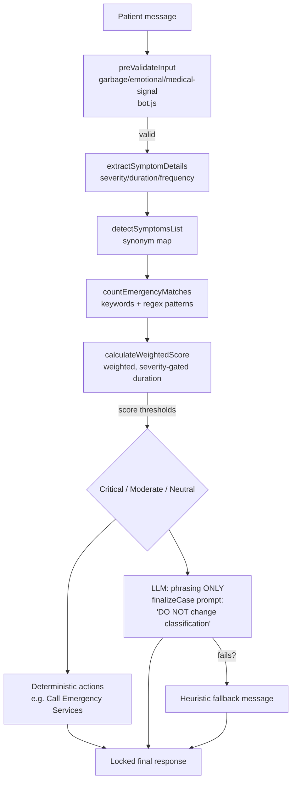

Key properties grounded in the code:

- **Severity is never the LLM's.** `calculateWeightedScore` (`services/ai.js`) produces
  the category from weighted, explainable rules; `finalizeCase` sends that decision to
  the LLM with `"DO NOT change the classification"` and only reads back a `message`
  string. If the LLM call throws or returns junk, a **deterministic fallback message** is
  used.
- **Emergencies bypass the LLM entirely.** In `bot.js`, `emergencyCount >= 2` (or 1 +
  "critical") instantly produces a locked Critical result with hardcoded emergency text —
  no model in the loop.
- **Explainability is built in.** Every result carries `reasons[]` and a `score/12`, so a
  clinician can see *why* something was classified.
- **Conversation is a locked state machine** (`WAITING_FOR_PROBLEM → CLARIFYING →
  FINAL`); once FINAL, the result is frozen and replayed.
- **PHI discipline:** `routes/chat.js` logs only message *length*, never content; identity
  comes from the JWT (`req.user.id`), never the client body.

### Why this matters

A pure-LLM triage bot is a regulatory and safety non-starter: non-deterministic,
un-auditable, and prone to hallucinated medical advice. The deterministic-core pattern
gives **reproducible, defensible decisions** with the LLM contributing only tone. This is
the right call and the target keeps it inviolable.

### TARGET — extending to Doctor Copilot / consult summary / Rx explanation

The growth path is to add **more LLM surfaces, all following the same contract**: the LLM
summarizes/explains/drafts, a human or deterministic check decides.

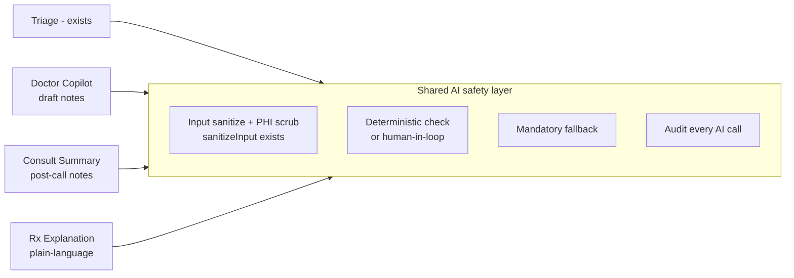

| New surface | LLM role | Deterministic safety / fallback | Hard rule |
|---|---|---|---|
| **Doctor Copilot** | Draft suggested questions / differential prompts from structured case data | Doctor must accept/edit; suggestions are never shown to the patient and never auto-applied | Advisory only; logged to `AuditLog` |
| **Consult summary** | Turn appointment + notes into a readable summary | Template-bounded; doctor signs off before it is saved to the record | LLM cannot invent diagnoses/medications not present in input |
| **Rx explanation** | Plain-language explanation of an *already-prescribed* `Prescription.medicines[]` | Source of truth is the stored Rx; LLM only rephrases; deterministic fallback = show the raw fields | LLM never selects or changes a medication or dosage |

**Rules that apply to every AI surface (the contract):**
1. The model **never makes an autonomous medical decision** — no diagnosis, no dosing, no
   triage override.
2. Every model call has a **deterministic fallback** so a model outage degrades gracefully
   (the triage path already does this; reuse the pattern).
3. Inputs are **sanitized** (`sanitizeInput` strips control chars and caps length) and
   PHI is minimized in prompts (send structured `caseData`, not raw transcripts where
   avoidable).
4. Every AI invocation is **audited** (`audit('ai.copilot.suggest', ...)`).

**Provider strategy & tradeoffs.**

- **Keep Ollama / local model as default.** Running the model on-prem means **PHI never
  leaves the trust boundary** — the strongest HIPAA posture and why the current local
  setup is correct.
- **Hosted models (Claude/GPT)** produce better prose for summaries/copilot, but require a
  signed BAA and PHI minimization. Make the provider **pluggable behind the existing
  `callOllama` seam** (`services/ai.js`) so a hosted model can be swapped in per-surface
  without touching the deterministic engine.
- **Scaling limit:** LLM latency is the constraint. Because the model is off the critical
  decision path, push non-interactive AI (consult summaries) to the **BullMQ AI worker**
  ([§5](#5-event-architecture)) so a slow generation never blocks an HTTP request. Add
  per-user rate limits (the chat route already shares `authLimiter`) and response caching
  for identical inputs.

---

## 7. Notification architecture

### CURRENT

- **In-app only, via the DB.** Appointment lifecycle handlers in `routes/appointments.js`
  construct `Notification` documents inline; the SPA polls them. The `Notification` model
  carries a dual schema (new `receiver_*`/`sender_*` plus legacy `doctor_id`/`patient_id`)
  — a migration in progress.
- **Email exists only for OTP** (`utils/otpService.js`) via Nodemailer→Gmail, with a
  graceful "test mode" log when SMTP isn't configured. No SMS, no push.
- Reminders are generated by the polling cron job ([§5](#5-event-architecture)).

### TARGET — channel-agnostic delivery with the outbox pattern

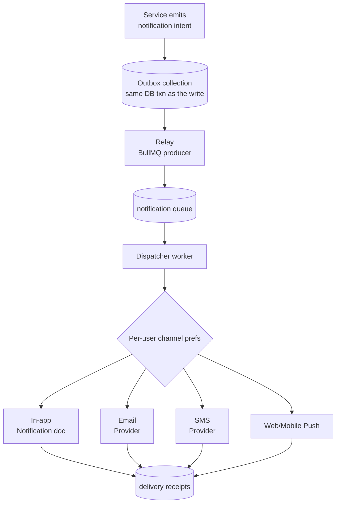

**Why the outbox pattern.** Today an appointment approval writes the appointment **and**
the notification as separate, un-transactional saves — if the process dies between them,
the patient is never told. The **transactional outbox** writes the *intent to notify* into
an `Outbox` collection **inside the same Mongo transaction** as the domain change; a relay
then hands it to the queue for delivery. This guarantees **at-least-once** delivery with no
lost notifications, and decouples "something happened" from "how we tell people."

- **Alternative:** emit straight to the queue from the handler (no outbox). Rejected —
  reintroduces the dual-write problem (DB commit succeeds, enqueue fails → silent loss).
- **Alternative:** change-data-capture off the Mongo oplog. Deferred — powerful but heavy
  ops; the application-level outbox is enough at this scale.

**Channels & provider choices (opinionated):**

| Channel | Recommended provider | Why | Alternative |
|---|---|---|---|
| In-app | existing `Notification` collection | already built; real-time upgrade via WebSocket later (`socket.io-client` is already a frontend dep) | — |
| Email | **Postmark** (transactional) | best deliverability + clear separation of transactional vs marketing; the current Gmail-SMTP via Nodemailer will rate-limit and land in spam at volume | SendGrid, SES |
| SMS | **Twilio** | reliability + global reach for appointment reminders | MessageBird |
| Push | **Web Push (VAPID)** then FCM/APNs for mobile | reaches users with the tab closed | OneSignal |

**Cross-cutting target rules.** Per-user **channel preferences** (extend
`DoctorSettings`/add patient prefs), **idempotency keys** so a retry can't double-send,
**delivery receipts** stored for audit, and **PHI minimization in external channels**
(an SMS/email says "you have an appointment update — open the app," not the clinical
detail). Reminders become **delayed BullMQ jobs scheduled at approval time**, replacing the
polling job.

**Scaling limit:** bounded by provider throughput and the dispatcher worker count; both
scale horizontally. The outbox relay is the one ordering-sensitive piece — keep it
single-consumer per partition.

---

## 8. Video consultation architecture

### CURRENT

There is **no video integration**. `Appointment.service_type` includes
`'Video Consultation'` and a free-text `meeting_link` string that a doctor pastes in
manually at approval time (`routes/appointments.js` `POST /:id/approve`). That link is then
embedded into notification text. There is no room lifecycle, no access control on the room,
and the link leaks into multiple notification/task message bodies.

### TARGET — Daily.co, room lifecycle bound to approval

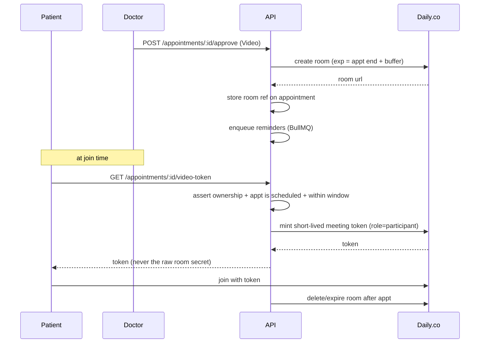

**Recommendation: Daily.co.** Reasoning vs the alternatives:

| Option | Reliability | Effort | Cost | HIPAA | Verdict |
|---|---|---|---|---|---|
| **Daily.co** | Managed global SFU, high | **Low** — prebuilt React component + token API | Usage-based, predictable | **BAA available** | **Chosen** |
| Twilio Video | High | Medium — more primitives to assemble | Usage-based | BAA available | Strong, but more to build; Twilio has also signaled video product churn |
| Jitsi (self-host) | You own it | **High** — run/scale the SFU, TURN, signaling yourself | "Free" minus large ops cost | You must engineer + attest it | Rejected for a small team |

The deciding factors: Daily gives a **prebuilt, embeddable client** (fastest path to a
working consult), **server-side room + token APIs** that let us bind a room's existence to
an appointment, and a **BAA** for PHI. For a clinic-scale team, build-vs-buy strongly
favors buy; the per-minute cost is trivial next to the engineering cost of operating Jitsi
+ TURN reliably.

**Room lifecycle tied to appointment approval (the important design rule):**

1. A room is **created only when a Video appointment is approved** — not at booking, not
   manually pasted. Created with an **expiry** at appointment end + a small buffer.
2. The room reference is stored on the appointment, replacing the free-text `meeting_link`.
3. **No one joins with a raw link.** Joining requires a **short-lived meeting token** minted
   by the API only after it asserts (a) the caller owns the appointment (the
   `requireOwnership` pattern from [§3](#3-backend-architecture)), (b) status is
   `scheduled`, and (c) the current time is within the join window.
4. The room is **expired/deleted** after the consult; an optional recording (if the BAA and
   consent allow) lands in the object store with a signed URL.

**Tradeoffs.** Tokenized rooms are more code than pasting a Jitsi link, but they make the
video session **access-controlled and auditable** — mandatory for PHI. **Scaling limit:**
Daily handles SFU scaling; our limit is the provider's concurrency tier and our
token-minting endpoint, which is cheap and cacheable per session.

---

## 9. Observability architecture

### CURRENT

A solid foundation already exists and should be built on, not replaced:

- **Request-id correlation** is real: `middleware/security.js` `requestId` sets `req.id`
  (honoring an inbound `X-Request-Id`) and echoes `X-Request-Id` on the response;
  `errorHandler.js` and `routes/chat.js` already log it.
- **Structured logging** is partial: `errorHandler.js` and the `server.js` process guards
  emit JSON log lines with level/msg/status/requestId/userId. But most route code still
  uses ad-hoc `console.log`/`console.error` with emojis (`jobs/*`, `routes/*`).
- **Health/readiness endpoints exist and are correct:** `GET /healthz` (liveness) and
  `GET /readyz` (returns 503 when Mongo `readyState !== 1`) — a real readiness probe, not a
  static string.
- No error tracker, no metrics, no tracing.

### TARGET

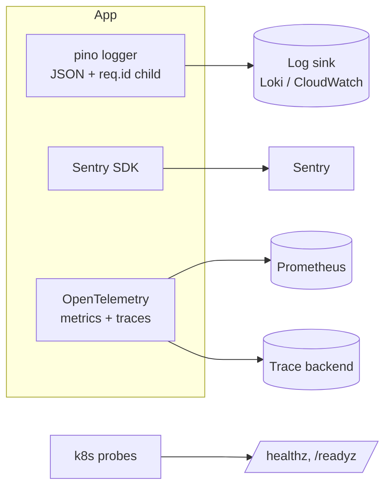

**Logging — adopt `pino`.** Replace every `console.*` with a single `pino` logger.

- **Why pino:** fastest Node logger, JSON-native (the codebase already hand-rolls JSON log
  lines — pino does it properly), and supports **child loggers** so each request gets a
  logger bound to `req.id` and `req.user.id`, giving free correlation across every log line
  in a request. **Alternative:** Winston — more flexible/heavier; pino's speed and
  ergonomics win for an API. **Tradeoff:** pino's pretty output needs `pino-pretty` in dev.
- **PHI rule:** keep the existing discipline (`routes/chat.js` logs message *length*, not
  content); configure pino redaction for tokens, passwords, OTPs.

**Error tracking — Sentry.** Initialize in `server.js`, wrap the Express error path so the
existing `errorHandler` reports 5xx to Sentry with the `requestId` as a tag. Why Sentry:
release-aware, groups exceptions, links front-end and back-end errors via the shared
request id. **Alternative:** self-hosted GlitchTip (Sentry-compatible) if data residency
demands it.

**Metrics & tracing — OpenTelemetry.** Export RED metrics (Rate/Errors/Duration) per
route, queue depth and job latency from BullMQ, Mongo op latency, and LLM call duration.
Use OTel SDK so the backend (Prometheus/Grafana) is swappable. **Why OTel:** vendor-neutral,
one instrumentation for metrics + traces. Trace ids should reuse / link to the existing
`X-Request-Id` so a single request can be followed SPA → API → worker → provider.

**Health endpoints — keep and extend.** `/healthz` and `/readyz` already exist; wire them
to k8s liveness/readiness probes and extend `/readyz` to also check Redis once it is
introduced.

**Scaling limit:** observability cost scales with cardinality. Keep label cardinality
bounded (don't label metrics by user id), and sample traces at high volume.

---

## 10. Security architecture — defense in depth

This is where MEDviz has invested most recently, and the baseline is genuinely good. The
honest framing: **the platform controls are largely in place; the per-record authorization
and some operational/process controls are not, and several of the hardest requirements are
legal/process, not code.**

### CURRENT — the security baseline (real, in the repo)

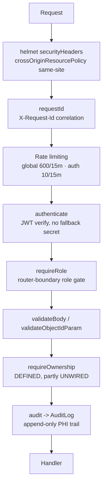

| Control | Where | Status |
|---|---|---|
| Fail-fast config | `server.js` refuses to start without a ≥32-char `JWT_SECRET` and `MONGODB_URI` | Done |
| JWT auth, no fallback secret | `middleware/auth.js` `authenticate` | Done |
| RBAC at router boundary | `server.js` `requireRole('admin'|'doctor')` | Done (coarse) |
| Boundary validation | `middleware/validate.js` | Done (needs wiring everywhere) |
| Append-only audit log | `middleware/audit.js` + `models/AuditLog.js` | Done (needs wiring on all PHI routes) |
| Secure file serving | `routes/files.js` — auth required, path-traversal blocked, replaces public `/uploads` static | Done |
| Rate limiting | `middleware/security.js` global + strict auth/LLM limiter | Done |
| helmet headers, `trust proxy` | `server.js` | Done |
| CSPRNG OTP + hashing | `utils/otpService.js` `crypto.randomInt`, sha256 | Done |
| Random unguessable upload names | `routes/auth.js` `crypto.randomUUID()` (was `Date.now()`) | Done |
| Centralized errors, no stack leak | `middleware/errorHandler.js` | Done |
| Double-booking guard at DB | `Appointment` partial unique index | Done |

### TARGET — what is still needed

**1. Per-record ownership in handlers (highest priority).** `requireOwnership` and
`loadAccount` already exist in `middleware/auth.js` but the mutating handlers in
`routes/appointments.js` (`/:id/approve`, `/:id/reject`, `/:id/reschedule`,
`DELETE /:id`) still `findById` and mutate **without verifying the appointment belongs to
the calling doctor**. `routes/files.js` itself notes that ownership is the resource
endpoints' job (ADR-002). Target: enforce ownership on every PHI mutation and read, in
middleware or the service layer. Router-level `authenticate` removed anonymous access; this
removes *cross-tenant* access (doctor A acting on doctor B's appointment, patient reading
another patient's report).

**2. Signed URLs for files.** Today `routes/files.js` streams from local disk after an auth
check. Target: move PHI documents to the object store and serve them via **short-lived
signed URLs** scoped to the authenticated, authorized user — so a leaked URL expires and a
file is never reachable without going through the authorization check first.

**3. Secrets management.** Secrets come from `.env` today (`JWT_SECRET`, `MONGODB_URI`,
`SMTP_*`). Target: a real secrets manager (AWS Secrets Manager / GCP Secret Manager /
Vault) with **rotation**, especially for `JWT_SECRET` (support key rotation with a short
overlap window) and provider API keys. Never bake secrets into images.

**4. Token handling.** Bearer token currently lives in the SPA's `localStorage`
(`axiosConfig.js`) — readable by any XSS. Target: short-lived access token in memory +
**httpOnly, Secure, SameSite refresh cookie**, plus a token/refresh rotation endpoint.

**5. Tighten transport & headers.** helmet runs with `contentSecurityPolicy: false` (the
comment says CSP is the static host's job) — make sure the frontend host **actually serves
a strict CSP**. Enforce HSTS at the edge. CORS is correctly origin-restricted + credentials
in `server.js`; keep `CORS_ORIGIN` locked to the real frontend origin in prod.

**6. HIPAA considerations — honest scope.** A large share of HIPAA compliance is **process
and legal, not code**, and this document cannot make the system "HIPAA compliant" by itself:

- **Business Associate Agreements (BAAs)** with every vendor that touches PHI — hosting,
  MongoDB Atlas, Daily.co, the email/SMS providers, and any hosted LLM. This is contractual.
- **Encryption at rest** (database + object store volumes) and **in transit** (TLS
  everywhere) — partly config, partly platform.
- **Access reviews, workforce training, incident-response and breach-notification
  procedures, retention/disposal policies** — organizational process.
- **Audit log retention & integrity** — the `AuditLog` collection is the technical
  foundation (append-only by convention); the *policy* for how long it's kept and how it's
  protected from tampering is process.
- **Minimum-necessary access** — the technical lever is the per-record ownership above;
  the policy is role design.

The right posture: implement the **technical** controls listed in 1–5 fully, and treat
HIPAA *certification* as a parallel organizational track. Engineering's job is to make the
system *capable* of compliant operation (auditable, access-controlled, encrypted,
PHI-minimizing) and to sign the appropriate BAAs; it cannot unilaterally "be compliant."

**Defense-in-depth summary:** edge (TLS/HSTS/CSP) → rate limiting → authn (JWT) → coarse
RBAC → fine-grained ownership → input validation → audit logging → least-privilege data
access → encrypted storage + signed URLs → secrets management. The first seven layers are
real or one wiring task away; the last three are the build-out.

---

## Appendix: ADRs and migration sequencing

The code references **ADR-002** (router-level auth now, per-record ownership in handlers).
Recommended ADRs to write down alongside this doc:

- **ADR-001** — Deterministic triage engine; LLM for phrasing only. *(Implemented in
  `services/ai.js` + `bot.js`.)*
- **ADR-002** — Authn/RBAC at the router boundary; per-record ownership in handlers/services.
  *(Referenced in `server.js` and `routes/files.js`; ownership wiring outstanding.)*
- **ADR-003** — BullMQ + Redis for all scheduled and event-driven work; no in-process timers.
- **ADR-004** — Daily.co for video; rooms bound to appointment approval, tokenized join.
- **ADR-005** — Transactional outbox for notifications; channel-agnostic delivery.

### Suggested sequencing (highest value first)

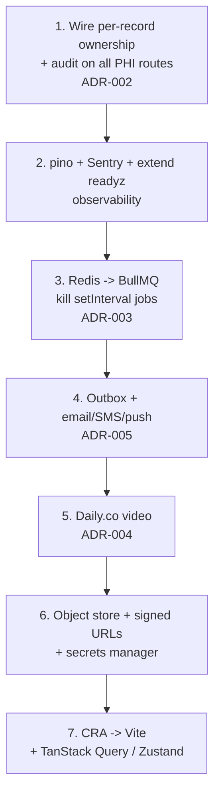

Security-critical items (ownership, audit wiring) come first because they close active PHI
exposure with the lowest effort — the middleware already exists. Frontend modernization
comes last: it is the largest-effort, lowest-risk item, and nothing downstream depends on it.
